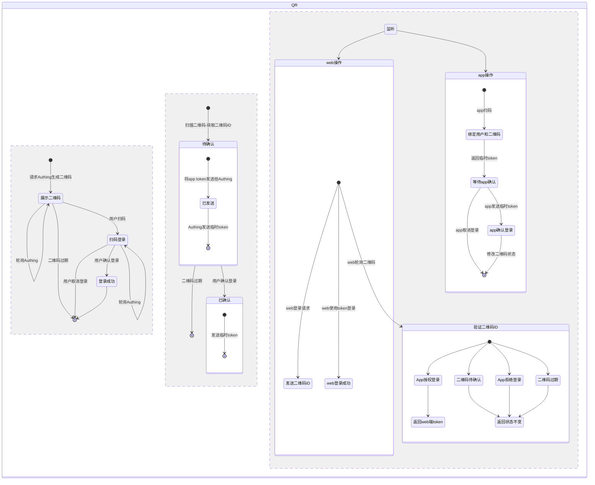

扫码登录是`请求登录方(web)`请求`已登录方(APP)`把`登录凭证(信息)`写入`特定媒介(二维码)`的过程.

```mermaid
stateDiagram-v2
    state QR {
        [*] --> 展示二维码: 请求Authing生成二维码
        展示二维码 --> [*]: 二维码过期
        展示二维码 --> 展示二维码: 轮询Authing
        展示二维码 --> 扫码登录: 用户扫码
        扫码登录 --> [*]: 用户取消登录
        扫码登录 --> 扫码登录: 轮询Authing
        扫码登录 --> 登录成功: 用户确认登录
        登录成功 --> [*]
        --
        [*] --> 待确认: 扫描二维码-获取二维码ID
        待确认 --> [*]: 二维码过期
        待确认 --> 已确认: 用户确认登录

        state 待确认 {
            [*] --> 已发送: 将app token发送给Authing
            已发送 --> [*]: Authing发送临时token
        }
        state 已确认 {
            [*] --> [*]: 发送临时token
        }
        --
        监听 --> web操作
        监听 --> app操作
        state web操作 {
            [*] --> 发送二维码ID: web登录请求
            [*] --> 验证二维码ID: web轮询二维码
            [*] --> web登录成功: web使用token登录
        }
        state 验证二维码ID {
            [*] --> App授权登录
            [*] --> 二维码待确认
            [*] --> App拒绝登录
            [*] --> 二维码过期
            App授权登录 --> 返回web端token
            二维码待确认 --> 返回状态不变
            App拒绝登录 --> 返回状态不变
            二维码过期 --> 返回状态不变
        }
        state app操作 {
            [*] --> 绑定用户和二维码: app扫码
            绑定用户和二维码 --> 等待app确认 :返回临时token
            等待app确认 --> [*]: app取消登录
            等待app确认 --> app确认登录: app发送临时token
            app确认登录 --> [*]: 修改二维码状态
        }
    }
```