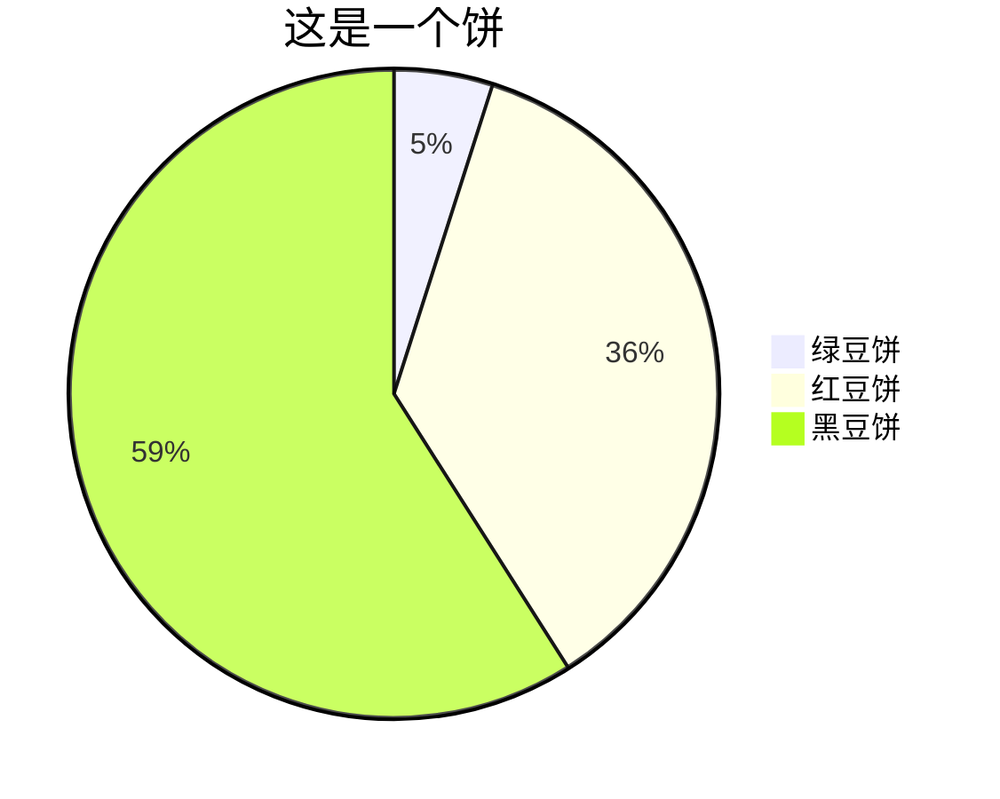
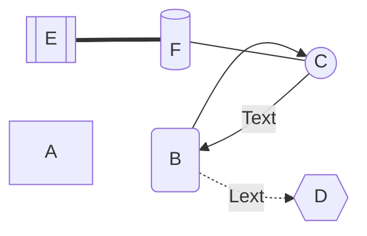
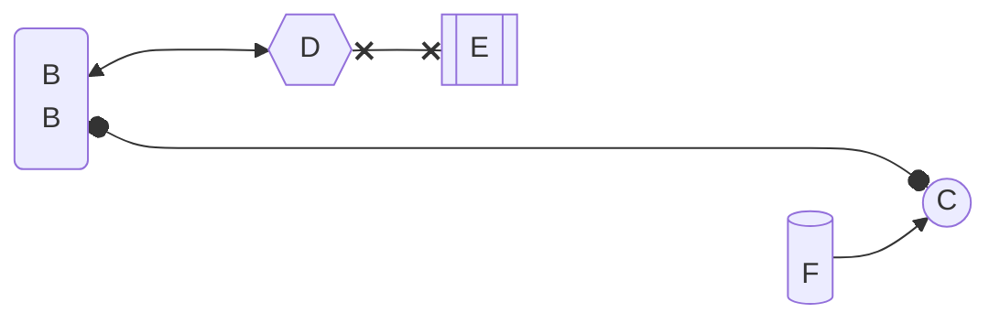

---

---

[Toc]


# H1

## H2

### H3

#### H4

##### H5

###### H6

**BOLD**

*Italic*

<u>underline</u>

`code

~~deleted~~

ctrl+/

==highlight==

power^2^


- [ ] unorder

  - list

  1. first
  2. second

- [x] todo
- [x] list

```c++
#include <iostream>
#include <sstream>
#include <utility>
#include <vector>
#include <tuple>
#include <bitset>
#include <regex>
std::vector<int> a;
int main()
{
	std::regex rx("\\w*\\.(cpp|cc|cxx)", std::regex::icase);
	std::smatch results;
	std::string test_str("dsagdas23123.cpp\n32123.Cpp\n423cdf.Cc\n	dasd.txt\n213asdf\nasd.ad");
	/*if (std::regex_search(test_str, results, rx))
		std::cout << results.str();*/
	for (std::sregex_iterator it(test_str.begin(), test_str.end(), rx), end;
		it != end; ++it)
		std::cout << it->str() << std::endl;
}
```


$$
LaTeX
$$
| Monday | Tuesday | Wednesday | Thursday | Friday |
| ------ | ------- | --------- | -------- | ------ |
|        |         |           |          |        |
|        |         |           |          |        |
|        |         |           |          |        |

> [Quote](#H3)(仅限标题跳转)		——Name[^1]

[bilibili](bilibili.com)

<!--注释-->

----


[^1]:from this

$$
\mathop \Phi \nolimits_e = \oint { \mathord{ \buildrel{ \lower3pt \hbox{$ \scriptscriptstyle \rightharpoonup$}} \over E} \cdot {d \mathord{ \buildrel{ \lower3pt \hbox{$ \scriptscriptstyle \rightharpoonup$}} \over S}}  = {1 \over {{\varepsilon _0}}}\sum {q} }
$$


$\alpha$

$$
x_i,{\rm x_i}
\text{ a b}
$$








```mermaid
flowchart TB
0(B)
1((C))
2{{D}}
3[[E]]
4[(F)]
subgraph sub
0 ----> 1 & 2 o--o 3 %%注释
end
```

<iframe src="//player.bilibili.com/player.html?aid=31289365&bvid=BV1iW411d7hd&cid=54672422&page=1" scrolling="no" border="0" frameborder="no" framespacing="0" allowfullscreen="true"> </iframe>


