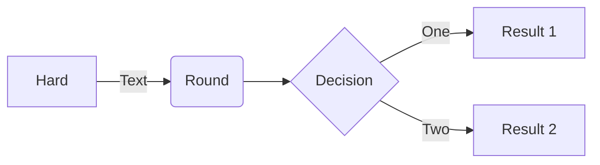
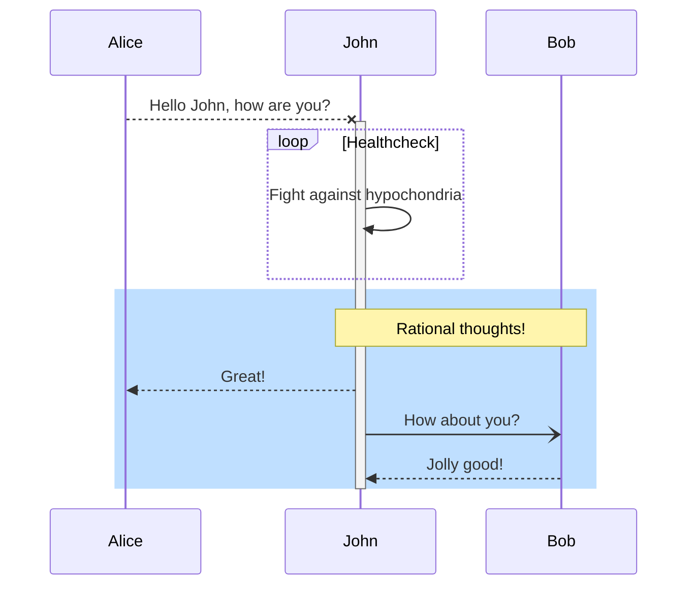
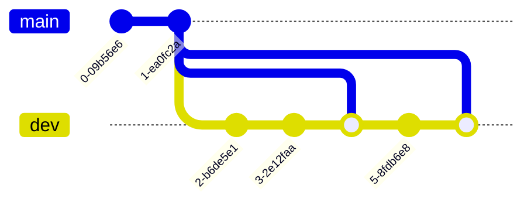
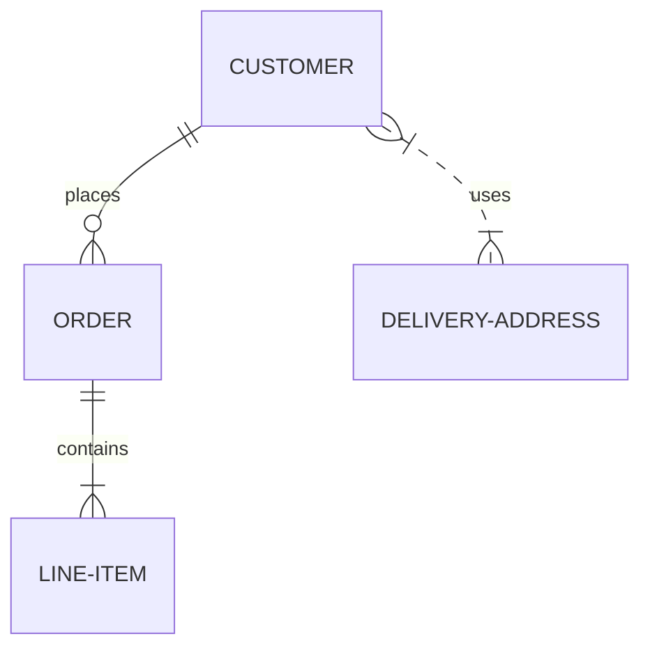
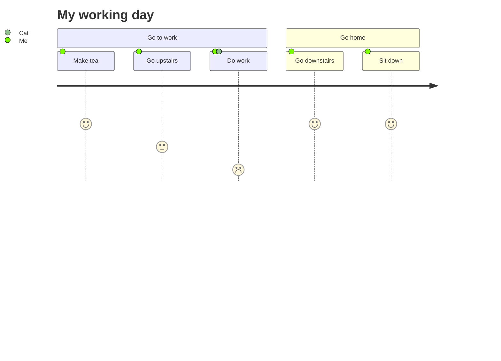
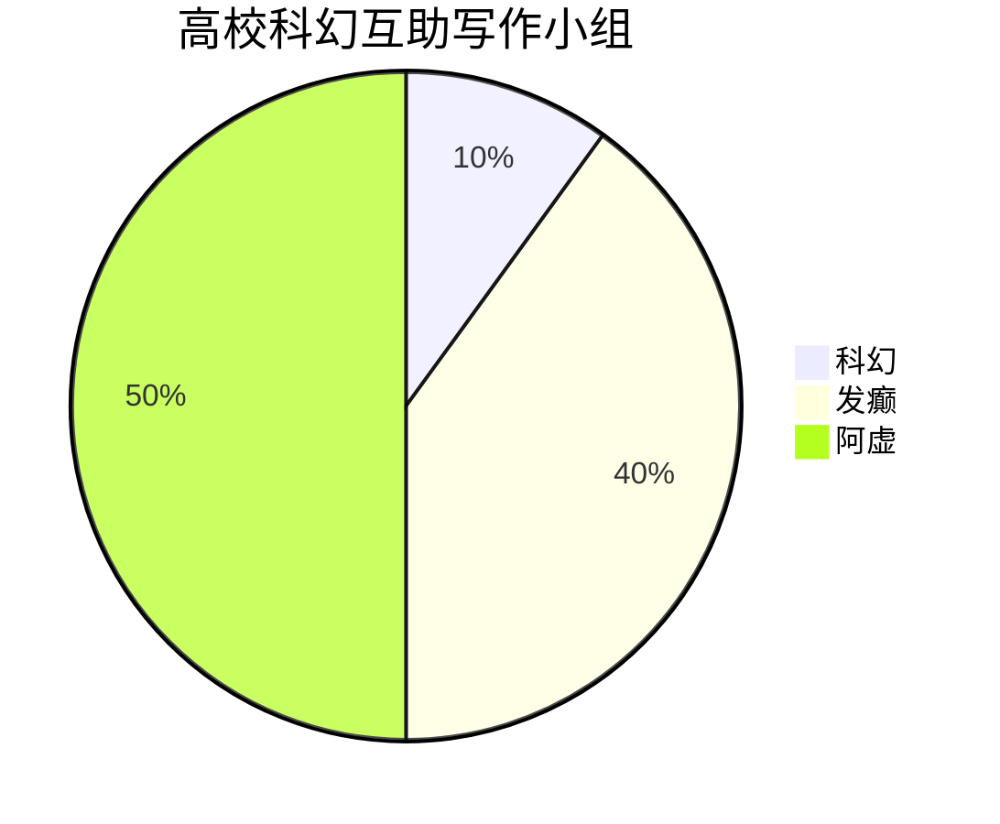

```mermaid
flowchart LR
A[Hard] -->|Text| B(Round)
B --> C{Decision}
C -->|One| D[Result 1]
C -->|Two| E[Result 2]
```

```mermaid
sequenceDiagram
Alice--x+John: Hello John, how are you?

loop Healthcheck
    John->>John: Fight against hypochondria
end
rect rgb(191, 223, 255)
Note over John,Bob: Rational thoughts!
John-->>Alice: Great!
John-)Bob: How about you?
Bob-->>John: Jolly good!
end
deactivate John
```

```mermaid
gitGraph
commit
commit
branch dev
commit
commit
merge main
commit
merge main

```

```mermaid
erDiagram
    CUSTOMER ||--o{ ORDER : places
    ORDER ||--|{ LINE-ITEM : contains
    CUSTOMER }|..|{ DELIVERY-ADDRESS : uses
```

```mermaid
journey
    title My working day
    section Go to work
      Make tea: 5: Me
      Go upstairs: 3: Me
      Do work: 1: Me, Cat
    section Go home
      Go downstairs: 5: Me
      Sit down: 5: Me
```

```mermaid
pie title 高校科幻互助写作小组
	"科幻" : 10
	"发癫" : 40
	"阿虚": 50
	
```

