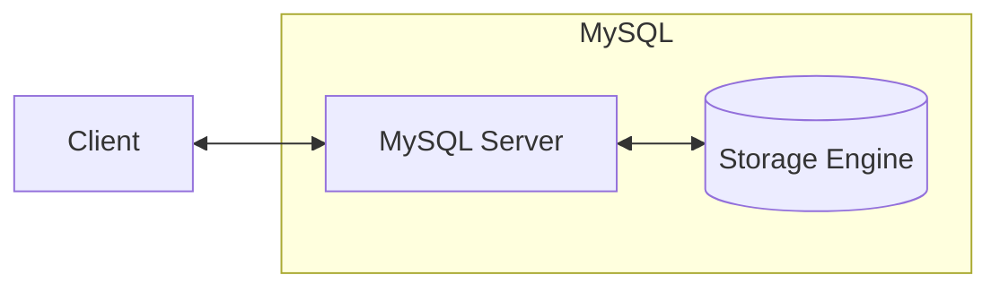

# MySQL索引原理及索引优化 

[toc]

## 索引与约束

### 索引是什么

索引是一个**有序**的存储结构

索引按照单个或者多个**列**的值进行排序

### 索引的目的

提升搜索效率

### 索引的分类

#### 数据结构

B+树索引

自适应的HASH索引（内存）

全文索引（elastic search）

#### 物理存储

InnoDB

聚集索引

辅助索引

#### 列属性(索引)

主键索引`PRIMARY KEY` （非空唯一索引）

唯一索引`UINQUE`（唯一索引，允许出现一个或多个`NULL`）

普通索引`INDEX`（允许重复）

```SQL
INDEX `index_name` (`c1`,`c2`)-- 联合索引
```

前缀索引（比较字符串前几个字符，加快排序）

#### 列个数

单列索引

组合索引

### 索引的代价

#### 空间

索引要占用空间，写入到磁盘当中

> 尽量不要超过6个索引

#### 时间

使用DML（增删改）时，INDEX也会被修改，维护索引结构


### InnoDB中的B+树

#### InnoDB中必须要有主键


具有`NOT NULL`和`UNIQUE`两个属性的列，会被选择为主键

为什么？

InnoDB 引擎中的索引是基于 B-tree 实现的，每个索引键必须唯一。

#### InnoDB中B+的特征？

多路平衡搜索树，中序遍历是有序的，通过比较key，所有叶子结点在同一层，叶子结点存储行数据

叶子结点之间相互连接，形成双向链表，节点默认大小是固定的16kb（4数据页）


//*查找ID在18-40内容过程*

聚集索引是`PRIMARY KEY`的B+树

非叶子结点只存储索引信息，叶子结点记录数据信息


```SQL
SELECT * FROM `user` WHERE `lockyNum = 33 ;
```

辅助索引是普通索引的B+树

在辅助索引中找出`PRIMARY KEY`，然后回到聚集索引找出数据（回表查询）

#### 为什么用B+树？

降低磁盘IO：平衡二叉树又瘦又高，查找数据需要多次磁盘IO，矮胖的B+树只要较少的磁盘IO

范围查询：所有叶子结点在同一层，且构成双向联表，范围查询很方便啊

*有哪些数据结构适合范围查询：跳表！*

### 索引的使用场景

`WHERE`

`GROUP BY`

`ORDER BY`

#### 不使用索引的情况

1. 其他情况不使用索引，==如果没有使用这些语句，没必要创建索引==

2. 如果列的区分度（一列数据中有多少不同的）不高，没必要创建索引

   `SELECT COUNT(DISTINCT index) / COUNT(1) FROM table_name;`

3. 经常修改的列，不创建索引，因为需要维护索引B+树
4. 表数据量小，感觉不如……全表扫描

## 覆盖索引

==针对的是辅助索引==

覆盖索引是一种数据查询方式，对于直接通过辅助索引B+树就能找到要查询的值，无需回表查询聚集索引

索引的比较有先后顺序，下面这个表示辅助索引，用name和cid索引`PRIMARY KEY`(index)

`KEY key(name,cid)`==相当于== `map<name,cid,index>`

在这个例子中，如果`SELECT name,id,cid FROM table`时，我们直接通过辅助索引拿到所有数据，这就叫覆盖索引

如果直接`SELECT *`查到了没有建立索引的列，那就很慢了

## 最左匹配原则

==针对的是组合索引==`WHERE condition1 AND condition2` 

在索引过程中，从左到右依此进行匹配，所以要优先保证左侧有序，遇到`> < BETWEEN LIKE`就可能停止匹配

```SQL
CREATE INDEX idx_users_name_age ON users (name, age);-- 一个例子
```
```SQL
SELECT id FROM users WHERE age = 30 AND name = 'John';-- 无法使用索引
```
```SQL
SELECT id FROM users WHERE name = 'John' AND age = 30;-- 能够使用索引
````


## 索引下推



在辅助查询中，把条件都下放到存储引擎，然后拿到`PRIMARY KEY`，再回表查询，减少Server曾和Engine层的交互

5.6版本开始支持

目的：减少回表次数，提升查询效率

如果没有索引下推：Server向存储引擎层请求数据，在Server层根据索引条件进行数据过滤

有索引下推：将索引条件下推到存储引擎中过滤数据，最终由存储引擎做数据汇总，返回给Server层

## 索引存储

### 数据页

16kb，buffer pool缓存数据页，用来降低磁盘IO次数


### Buffer Pool

change buffer 辅助索引

Buffer Pool缓存表和索引数据；采用LRU算法，让Buffer Pool只缓存较热的数据

当一个`SELECT`到来，使用自适应HASH索引判断某个页是否在缓存中，如果在缓存命中，直接操作，否则开始数据映射

DML修改时，在Buffer Pool修改的数据信息会储存在flush list中

有三个循环联表储存着位置：

==free list==-空闲的Buffer Pool

==flush list==

==LRU list==-新数据进来时放在$$\frac{5}{8}$$位置，每次查询后热数据前移，冷数据后移，不断淘汰冷数据。


### Change Buffer

缓存非唯一索引的数据变更，这些数据逐渐合并到Buffer Pool

## 索引原则

查询频次较高，过滤效果好（区分度）的列或者组合

尽量使用短索引，比如`SMALLINT`

对于字符串索引，考虑使用前缀索引，可以通过测试区分度选择

```SQL
SELECT COUNT(DISTINCT LEFT(name,3)) / COUNT(*) AS sel3;
```

==别天天`SELECT *`==

对于经常一起查询的内容，可以使用组合索引

==`EXLAIN`关键字可以分析查询状态==

## 索引失效

### 左模糊

`LIKE‘%A’`不可以索引

### 索引参与运算

#### 使用函数

#### 进行表达式运算

`WHERE a-1 =3 `

#### 隐式转换

比如隐式的将字符串和INT转换，相当于使用了函数

MySQL在`VARCHAR`和`INT`比较时，会自动把字符串转为（预处理）数字

### `WHERE`

OR

IN

> 总之，你动了索引位，就没办法索引了

## 优化SQL

### 找到慢的语句：

1. 当时就慢，卡住了，`SHOW PROCESSLIST`找到那一条语句
2. 不是特别慢，开启慢查询日志。

### 分析SQL语句

看索引：`WHERE, GROUP BY, ORDER BY`

`IN`优化成联合查询

减少联合查询

不要使用age这种会经常修改的字段，使用生日这种不变的
