# MySQL事务原理分析

[toc]

## 事务

（transaction）

> 前提：并发连接访问时才考虑事务

主线程监听连接，一条连接进入，分配一条连接线程。

### 事务语句

```SQL 
-- 开启事务
START TRANSACTION
COMMIT
ROLLBACK
```

一个事务的生命周期：Begin到Commit 或 Begin到Rollback

### ACID特性

#### 原子性（atomicity）

undolog，一种数据库日志，记录事务的操作过程，回滚时做反向操作

#### 一致性（consistency）

一种约束，数据库从一种一致性状态转变为另一种一致性状态

数据库的完整约束

逻辑上一致性，有时会破坏一致性以期提高并发性能

#### 隔离性（isolation）

防止多个并发事务交叉执行导致数据不一致

通过锁和MVCC来实现

#### 持久性（durability）

redolog，记录DML对物理页修改的内容

因为redolog是顺序追加，所以速度快，然后redolog异步地把数据刷新到磁盘B+中

binlog 用于主从备份


commit之后，一个transaction结束。

 - 除此之外，对于`InnoDB`任何一个单独的SQL语句，也相当于一个事务。而如果使用了`BEGIN`，就一定要`COMMIT`之后，一个事务才算完成。

## ==隔离级别==

目的：提升并发性能

隔离级别越高，运行效率越低，降低隔离级别会影响逻辑上的一致性。

这个隔离级别是对线程说的

```SQL
SET TRANSACTION ISOLATION LEVEL READ UNCOMMITTED;
```

==任何隔离级别，写操作都自动加X锁==

#### read uncommitted

这是最低级别的隔离级别，它允许事务读取其他事务未提交的数据。在此级别下，事务可能会看到其他事务已经插入、更新或删除的行，但是这些更改可能最终不会被提交。因此，读取未提交的数据可能会导致脏读的问题。

```mermaid
gantt
		dateFormat s
        title Read Uncommitted Isolation Level
		
        section Transaction 1
        T1 starts: 0, 1
        T1 reads data: 1, 2
        T1 updates data: 2, 3
        T1 commits: 3, 4

        section Transaction 2
        T2 starts: 1, 2
        T2 reads uncommitted data: 2, 3
        T2 updates data: 3, 4
        T2 commits: 4, 5

```


==出现了脏读==

#### read committed

在这个隔离级别下，事务只能看到已经提交的数据。其他事务所做的更改只有在提交后才会对其他事务可见。这种隔离级别可以避免脏读的问题，但是可能会出现不可重复读和幻读的问题。

```mermaid
gantt
		dateFormat s
        title Read Committed Isolation Level
        section Transaction 1
        T1 starts: 0, 1
        T1 reads data: 1, 2
        T1 updates data: 2, 3
        T1 commits: 3, 4
        
        section Transaction 2
        T2 starts: 1, 2
        T2 reads unmodified data: 2, 3
        T2 commits: 3, 4

```


==避免了脏读==

```mermaid
gantt
		dateFormat s
        title Read Committed Isolation Level
        section Transaction 1
        T1 starts: 0, 1
        T1 reads unmidified data: 1, 2
        T1 reads modifed data: 4, 5
        T1 commits: 5, 6
        
        section Transaction 2
        T2 starts: 0, 1
        T2 updates data: 2, 3
        T2 commits: 3, 4

```


==出现了不可重复读==


#### repetable read（可重复读）

在这个隔离级别下，事务可以多次读取相同的数据，而且每次读取的结果都相同。即使在其他事务插入或删除数据时，该事务也不会看到这些更改。因此，可重复读可以避免不可重复读的问题，但是可能会出现幻读的问题。

```mermaid
gantt
		dateFormat s
        title Read Committed Isolation Level
        section Transaction 1
        T1 starts: 0, 1
        T1 storages state: 0, 1
        T1 reads storaged data: 1, 2
        T1 reads storaged data: 4, 5
        T1 commits: 5, 6
        
        section Transaction 2
        T2 starts: 0, 1
        T2 storages state: 0, 1
        T2 updates data: 2, 3
        T2 commits: 3, 4

```

==避免了不可重复读==

```mermaid
gantt
		dateFormat s
        title Read Committed Isolation Level
        section Transaction 1
        T1 starts: 0, 1
        T1 storages state: 0, 1
        T1 finds data with scope: 1, 2
        T1 finds data with scope: 4, 5
        T1 commits: 5, 6
        
        section Transaction 2
        T2 starts: 0, 1
        T2 storages state: 0, 1
        T2 inserts data in to scope: 2, 3
        T2 commits: 3, 4
```



==出现了幻读==
MVCC帮我们解决了一部分幻读问题，在第一次读的过程中：
`SELECT * FROM table WHERE 'SCOPE'`会出现幻读 
`SELECT * FROM table WHERE 'SCOPE' FOR UPDATE`不会出现幻读 

这里的`FOR UPDATE`就是==加锁==！

#### serializable

在这个隔离级别下，所有事务都会按照顺序执行，就像是串行执行一样。这样可以避免所有的并发问题，但是会导致性能下降，因为所有的事务都需要等待其他事务完成才能开始执行。

```mermaid
gantt
	dateFormat s
    title Serializable Read Isolation Level
section Transaction 1
        T1 starts: 0, 1
        T1 reads data: 1, 2
        T1 updates data: 2, 3
        T1 commits: 3, 4

        section Transaction 2
        T2 starts: 1, 2
        T2 waits for T1: 2, 3
        T2 retries: 3, 4
        T2 reads data: 4, 5
        T2 updates data: 5, 6
        T2 commits: 6, 7
```




> 幻读与不可重复读的区别在于，不可重复读是指在一个事务中，多次读取同一行数据，但是由于其他事务的修改，导致读取到的数据不同。而幻读则是指在一个事务中，多次执行相同的查询语句，但是由于其他事务的插入或删除操作，导致查询结果不同。
>
> 例如，一个事务在查询某个表中所有的数据，并对这些数据进行统计，然后再次查询时发现有新的数据被插入了，那么这个事务执行两次查询的结果就会不同。这就是幻读现象。
>
> 幻读的原因是在可重复读隔离级别下，事务在执行查询操作时会对查询结果的所有行加锁，防止其他事务对这些行进行修改。但是如果其他事务插入了一行新数据，这行数据就不会被加锁，导致在后续查询时出现了新的结果。

## 不同隔离级别并发异常

| 脏读             | 不可重复读 | 幻读 |      |
| :--------------- | :--------: | ---- | :--: |
| Read uncommitted |     ○      | ○    |  ○   |
| Read committed   |     ×      | ○    |  ○   |
| Repeatable read  |     ×      | ×    |  ○   |
| Serializable     |     ×      | ×    |  ×   |

### 脏读

一个事务读到另一个未提交事务修改的数据

### 不可重复读

一个事务两次读取同一个数据不一样（因为其他事务更新了数据）

### 幻读

一个事务内读取同一范围的结果集不一样（聚集函数）

## MVCC

==一致性非锁定读==

Multiversion concurrency control

### read_viem

事务开启的时候创建，事务中有SELECT时创建

#### m_ids

创建read_viem时，启动但未提交的事务id列表

#### min_trx_id

创建read_viem时，启动但未提交的最小事务id

#### max_trx_id

创建read_viem时，预分配给下一个未开启事务的id(类似于STL的end)

#### creator_trx_id

创建改read_view的事务id

### 聚集索引记录的隐藏列

记录：一整条行的信息

聚集索引：通过主键找东西的索引

_raw_id：如果没有创建主键，InnoDB帮你创建一个默认主键

#### trx_id

某个事物修改了数据（不一定提交），trx_id记录

无论什么隔离级别，写都有X锁，所以同时只会被一个事务修改

#### roll_pointer

事务修改记录时，会自动把旧记录写入undo_log中

roll_pointer是一个链表，一层一层指向历史版本信息。10->9->8->…

### 事务可见性问题

#### 事务可以看到事务自身修改后的数据

（creator_trx_id==trx_id）

#### 事务间的可见性

trx_id < min_trx_id，说明已经提交了，可见的

trx_id >= min_trx_id，说明事务修改在之后，不可见的

min_trx_id <= trx_id max_trx_id

这里有两张情况

- trx_id IN m_ids 已启动，但未提交，不可见
- trx_id NOT IN m_ids 已提交，可见的

### 两种使用read view的隔离级别

读已提交

每次读取数据，都生成新的read_view，两次读可能结果不一样，不能重复读 

可重复度

只在BEGIN的时候创建read view，所以事务中两次读，看到的数据是一样的

### 快照读

纯纯的`SELECT * FROM table WHERE condition`

### 当前读

可能出现幻读问题

```SQL
SELECT * FROM table WHERE condition LOCK IN SHARE MODE -- S
SELECT * FROM table WHERE condition FOR UPDATE -- X
```

手动加锁↑

## 锁

==InnoDB中的锁==

### 锁


### 全局锁

锁数据库，锁一个database

```SQL
FLUSH TABLES WITH READ LOCK;
UNLOCK TABLES;
```

### 表级锁

#### 表锁

```SQL
LOCK TABLES `table` [read / write]；
UNLOCK TABLES;
```

加了锁，我这个线程也不能操作

#### 元数据锁

一个线程在修改表的结构（ALTER），不许别人操作数据

#### 意向锁

目的：快速判断表里是否有记录加锁

在行里加锁后，给表加一个意向锁IS(Intension Shared Lock)

#### auto-inc锁

特殊表锁，实现自增约束，语句结束后就释放锁，而非在事务结束时释放

### ==行级锁==

#### 记录锁(record lock)

S锁 共享锁

X锁 排他锁

#### 间隙锁(gap lock)

==Repeatable Read隔离级别使用==

用来解决幻读问题，防止其他事务在记录间插入新的记录，从而避免幻读现象

在`SELECT WHERE`找一行未命中后，在全开区间里加入间隙锁，使得其他线程无法插入数据

如果命中了，家一个记录锁

#### 临键锁

(next-key lock)

记录锁+间隙锁，锁定一个范围，以及记录本身，左开右闭。

### 查询

## 死锁

### 死锁原因

事务互相争夺对方持有的资源，互相等待

### 相反加锁，顺序死锁

为了提高效率，插入意向锁

插入意向锁经常和GAP锁冲突导致阻塞，==死锁之源==
